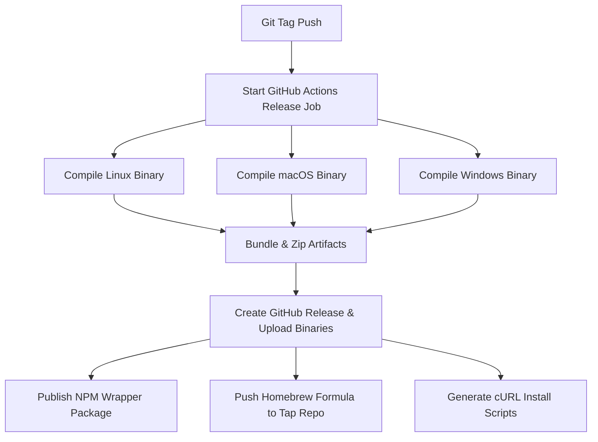

# 🚀 Distribuição Automatizada com `cargo-dist`

Este guia detalha como configurar seu repositório Git e a pipeline do GitHub Actions para publicar e distribuir o `tucupi` de forma automatizada para múltiplos canais (binários diretos, cURL scripts, Homebrew e NPM).

---

## 📋 Pré-requisitos

1. **Repositório GitHub**: O projeto deve estar hospedado em um repositório no GitHub (a URL de origem deve coincidir com o `repository` definido no `Cargo.toml`).
2. **Permissões de Actions**: A pipeline precisa de permissão de escrita para criar as Releases do GitHub e anexar os binários compilados.

---

## 🔑 Configuração de Segredos (Secrets)

Para que a pipeline consiga publicar nos registros de pacotes externos, você deve configurar os seguintes **Actions Secrets** nas configurações do seu repositório GitHub (`Settings > Secrets and variables > Actions`):

| Nome do Secret | Descrição | Obrigatório? |
|---|---|---|
| `NPM_TOKEN` | Token de automação para publicar o wrapper NPM no registro do npmjs.org. | Sim (se usar o instalador NPM) |
| `CARGO_REGISTRY_TOKEN` | Token de API do crates.io para publicar o crate original de Rust. | Opcional |
| `GH_TOKEN` ou `PAT` | Personal Access Token com escopo de escrita no repositório de tap do Homebrew. | Sim (se usar instalador Homebrew) |

---

## 🛠️ Como disparar uma Nova Release

A pipeline gerada em `.github/workflows/release.yml` é disparada de forma totalmente automatizada sempre que você envia uma nova tag Git correspondente à versão do projeto.

### Passo 1: Atualizar a Versão no `Cargo.toml`
Se você está lançando a versão `0.1.0`, certifique-se de que a linha `version` no `Cargo.toml` reflita este valor:
```toml
[package]
name = "tucupi"
version = "0.1.0"
```

### Passo 2: Criar e Enviar a Tag Git
Rode os seguintes comandos no terminal:
```bash
# Criar a tag local
git tag v0.1.0

# Enviar a tag para o GitHub
git push origin v0.1.0
```

---

## ⚡ O que a Pipeline Faz por Trás dos Panos

Ao receber a tag `v0.1.0`, o GitHub Actions executará os seguintes passos configurados em `.github/workflows/release.yml`:



1. **Compilação Multiplataforma**: Inicializa runners virtuais para Ubuntu (Linux), macOS e Windows.
2. **Build Estático**: Compila binários otimizados de Rust para cada arquitetura alvo.
3. **Criação da Release**: Cria automaticamente uma Release no GitHub com as notas do commit e anexa os zips contendo os binários.
4. **Instaladores**:
   * Gera e envia os scripts `install.sh` (cURL/Bash) e `install.ps1` (PowerShell).
   * Atualiza a fórmula do Homebrew no repositório de tap indicado.
   * Publica o wrapper npm que identifica o sistema operacional do usuário final e instala o binário correspondente.
